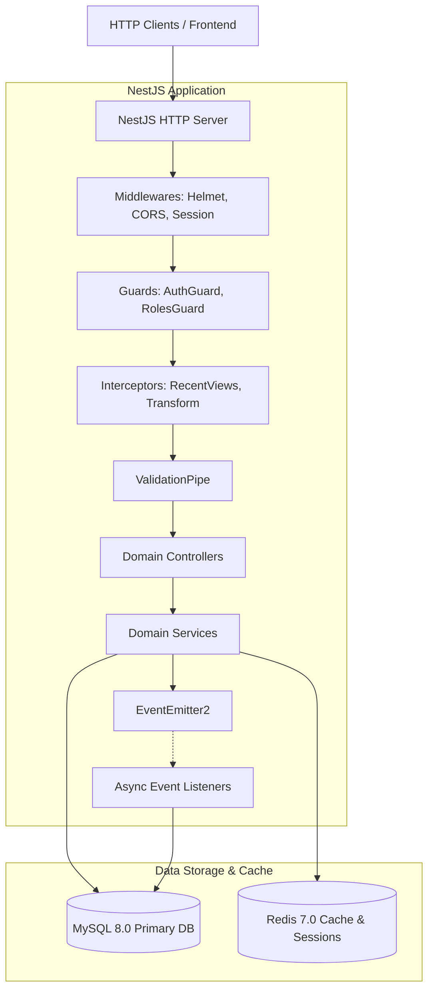

# System Architecture

High-level architecture, module design, and request lifecycle for the Bookstore NestJS API.

---

## 1. High-Level Architecture

The Bookstore API is a modular backend built with NestJS, TypeORM, MySQL 8, and Redis 7. It provides an e-commerce platform and content management system for books, authors, publishers, reviews, orders, and customer support.



---

## 2. Layered Module Structure

Every feature module in `src/modules/` adheres to a strict layered structure:

```
src/modules/<feature>/
├── dtos/              # Request and response data transfer objects with class-validator
├── entities/          # TypeORM database entities and schemas
├── controllers/       # HTTP route handlers (routing, status codes, query parsing)
├── services/          # Core business logic and database queries
├── guards/            # (optional) Module-specific route guards
├── listeners/         # (optional) Asynchronous domain event listeners
└── <feature>.module.ts # Dependency injection container definition
```

### Module Responsibilities

| Module | Core Purpose |
| :--- | :--- |
| **`app`** | Root application module; configures ConfigModule, TypeOrmModule, CacheModule, EventEmitterModule, ThrottlerModule |
| **`auth`** | User authentication (signin, signup, signout), Bcrypt hashing, Redis session management, and RBAC guards |
| **`authors`** | Author biographies, published titles, translations, and author profile management |
| **`blogs`** | Publishing house and author blog posts, articles, and content publishing |
| **`books`** | Divided into specialized controllers: `Books` (inventory/pricing), `Titles` (literary works), `Characters`, and `Bookmarks` |
| **`collections`**| Curated book collections created by staff and authenticated users |
| **`discount-codes`** | Promotional vouchers with percentage or fixed deductions, date validity, and usage limits |
| **`health`** | Cloud-native health checks via Terminus monitoring MySQL and memory thresholds |
| **`languages`** | ISO languages supported for physical editions and translations |
| **`orders`** | Shopping cart checkout, atomic inventory decrements, payment state machine, and fulfillment |
| **`publishers`** | Publishing house corporate profiles and published books |
| **`reviews`** | Multi-entity review system (books, blogs, authors, publishers) with replies and emoji reactions |
| **`staffs`** | Staff accounts, employment metadata, and asynchronous audit log processing |
| **`tags`** | Hierarchical taxonomy and root tagging system for books and content |
| **`tickets`** | Customer support ticketing system with status lifecycles and priority |
| **`token`** | Cryptographic token generation and verification utilities |
| **`users`** | User profiles, contact records (email, phone), addresses, and permission roles |
| **`views`** | Non-blocking Redis view tracking, deduplication, and trending content calculations |

---

## 3. Global Request Lifecycle

Every incoming HTTP request flows through a predictable execution pipeline:

```
1. Express Middlewares
   ├── helmet()                  -> Sets HTTP security headers (CSP, HSTS, XSS)
   ├── cors()                    -> Handles origin validation and credentials
   └── session()                 -> Loads Redis session from connect.sid cookie

2. NestJS Guards
   ├── ThrottlerGuard            -> Global rate limit (100 req/min)
   ├── AuthGuard                 -> Verifies active session
   └── RolesGuard                -> Verifies user role against @RequiredRoles()

3. NestJS Interceptors (Pre-Controller)
   ├── RecentViewsInterceptor    -> Inspects route for @TrackRecentView()
   └── TransformInterceptor      -> Captures start timestamp

4. NestJS Pipes
   └── ValidationPipe            -> Validates DTOs, strips non-whitelisted properties, transforms types

5. Route Handler
   └── Controller -> Service     -> Executes business logic and database queries

6. NestJS Interceptors (Post-Controller)
   └── TransformInterceptor      -> Wraps output in { statusCode, timestamp, data }

7. NestJS Exception Filters
   ├── TypeOrmExceptionFilter    -> Maps SQL 1062 to 409, 1452 to 404/400
   └── HttpExceptionFilter       -> Formats standard error envelopes
```

---

## 4. Event-Driven Decoupling

Cross-cutting operations (such as audit logging, cache invalidation, and notifications) are decoupled from primary request-response flows using `@nestjs/event-emitter`.

- Services emit strongly-typed events via `EventEmitter2.emit(EventNames.XYZ, payload)`.
- Listeners handle events with `@OnEvent(EventNames.XYZ, { async: true })`.
- Operations run out-of-band without increasing API response latency.
