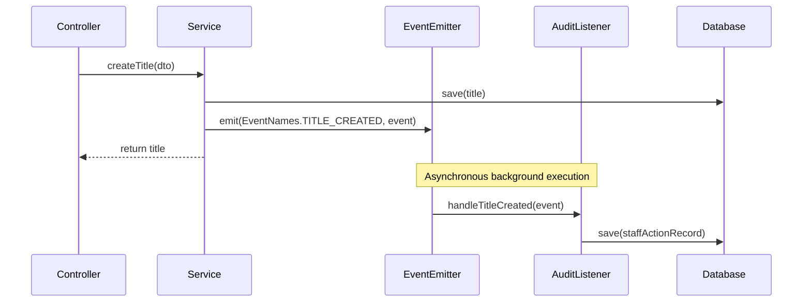

# Event-Driven Architecture

Documentation for domain events, event naming constants, and asynchronous event listeners.

---

## 1. Overview

The application uses `@nestjs/event-emitter` to decouple catalog and order actions from background operations like audit logging.



---

## 2. Event Names & Catalog

Event names are centralized in `src/common/enums/event.names.ts`:

```typescript
export enum EventNames {
  TITLE_CREATED = 'title.created',
  TITLE_UPDATED = 'title.updated',
  BOOK_CREATED = 'book.created',
  BOOK_UPDATED = 'book.updated',
  ORDER_PLACED = 'order.placed',
}
```

### Event Classes

Defined in `src/common/events/`:
- `TitleCreatedEvent`: Emitted when a book title is created. Payload contains `titleId` and `staffId`.
- `TitleUpdatedEvent`: Emitted when title metadata is modified. Payload contains `titleId`, `staffId`, and `changes`.
- `BookCreatedEvent`: Emitted when a physical book edition is added.
- `BookUpdatedEvent`: Emitted when book edition details are updated.
- `OrderPlacedEvent`: Emitted when a customer order completes checkout.

---

## 3. Registering Event Listeners

To add a new asynchronous subscriber:

```typescript
import { Injectable } from '@nestjs/common';
import { OnEvent } from '@nestjs/event-emitter';
import { EventNames } from 'src/common/enums/event.names';
import { OrderPlacedEvent } from 'src/common/events/orders/order-placed.event';

@Injectable()
export class NotificationListener {
  @OnEvent(EventNames.ORDER_PLACED, { async: true })
  async handleOrderPlaced(event: OrderPlacedEvent) {
    // Background execution: send confirmation email or notification
  }
}
```

Setting `{ async: true }` ensures that listener execution runs out-of-band without blocking the HTTP response.
